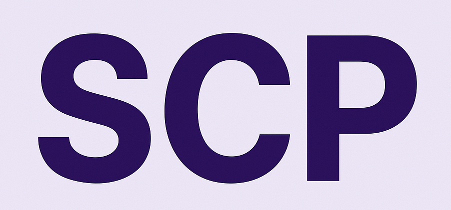

Overview
--------

**Scientific Computing Project (SCP): Image Classification Pipeline**

This project provides a **modular, extensible, and research-oriented deep learning pipeline** for image classification, developed as part of the Scientific Computing Project (SCP). It is designed for experimentation, hyperparameter optimization, and architecture extensibility.

The first implemented architecture is based on **VGG-16**, with clear separation of training, tuning, and evaluation components. Additional architectures will be added in future updates.

The pipeline offers:

- Full control over training experiments
- K-Fold Cross-Validation based hyperparameter tuning
- Strong data augmentation & evaluation methodology
- Clear and clean structure for further model extensions

Features
--------

- **Research-Grade Modular Design**
  - Multiple architecture support (VGG-16, others upcoming)
  - Clear folder structure

- **Training Strategy:**
  - Hyperparameter Tuning with K-Fold Cross-Validation (K=3)
  - Optimizer comparison (AdamW & SGD with Momentum)
  - Early stopping & learning rate scheduling

- **Data Augmentation:**
  - Horizontal/Vertical Flip
  - Random Rotation, Shift, Scale
  - Color Jitter
  - CutMix / MixUp (optional)

- **Evaluation Metrics & Visualization:**
  - Loss and Accuracy Curves
  - ROC & PR Curves
  - Confusion Matrix
  - F1 Score & Per-Class Accuracy
  - Hyperparameter Tuning Result Visualization
  - t-SNE Embedding Visualization

Benchmarks
----------

The evaluation results and visualizations are saved under `results/` directory. They include:

| Metric                      | Description                           |
|:----------------------------|:--------------------------------------|
| Training Loss Curve        | Loss vs Epochs during training        |
| Validation Accuracy Curve  | Accuracy vs Epochs on validation set  |
| Confusion Matrix           | Per-class classification visualization|
| ROC & PR Curves            | Receiver Operating & Precision-Recall |
| F1 Score                   | Per-class evaluation metric           |
| t-SNE Plot                 | Embedding visualization               |
| Hyperparameter Results     | Grid search visualization             |
| Optimizer Comparison       | AdamW vs SGD test accuracy            |

License and Reference
---------------------

This project is licensed under the [MIT License](https://opensource.org/licenses/MIT).

If you use this project for academic or research purposes, please consider citing it or mentioning the contributors.

Contributors
------------

The following contributors are actively working on this project:

- <a href="https://github.com/Lars314159">Lars Wunderlich</a>
- <a href="https://github.com/ToniMahojoni">Toni Sand</a>
- <a href="https://github.com/hounaar">Parsa Besharat</a>

Development Status
------------------

This project is in **active development** under the Scientific Computing Project (SCP). Additional architectures and evaluation modules will be added in future releases.

For questions, issues, or contributions, please use the [GitHub repository](https://github.com/hounaar).

